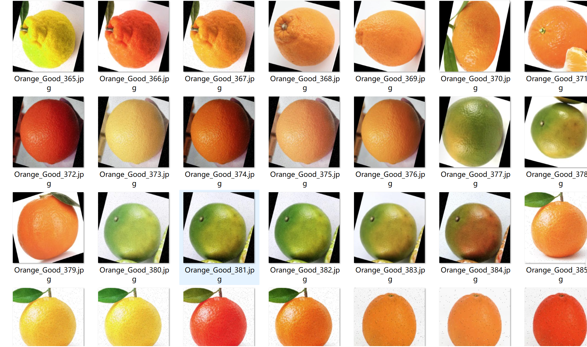
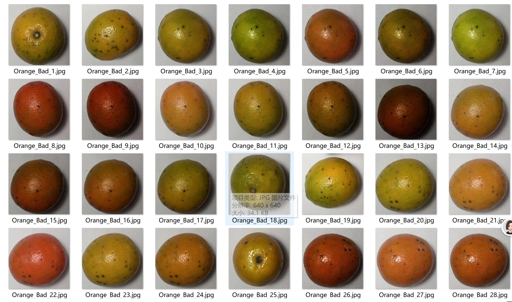

# Orange Fruit Classification Dataset - Image Classification

Dataset Introduction:
- Number of images in folder "Orange_Bad": 4873
- Number of images in folder "Orange_Good": 4704
- Total number of images across all subfolders: 9577

Images in the directory:
- For inquiries, simply add your question directly. There is no need for friend verification; you can send messages without my approval, and I will be able to see them.
- Search for me, and send all your questions at once. I will respond to you, sometimes busy, so please describe your question and intention clearly when you are ready.
- When I am free, I will also respond to you, without needing any formalities, which makes it more efficient.
- Phone numbers are also the same as above. If I forget to respond or if you are impatient, you can send a text message or call me.

## Images

Here is a pay link on Stripe ( https://buy.stripe.com/3cs8yP7sY87d0vu9AB ). Please contact me lonlonago@foxmail.com after funding $89, and I will send you a complete data files , thank you!

